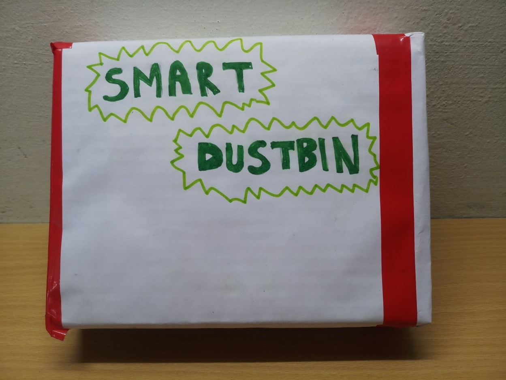

# Smart-Dustbin
An IoT based smart dustbin system

An IoT based smart dustbin module which can be fitted in any dustbin to make it smart. When fitted in a dustbin this module sends notification and email to the user when dustbin is full.

## Components Used
1. Arduino Uno
2. Ultrasonic sensor HC-SR04
3. Node MCU ESP8266             
4.	Connecting wires
5.	Battery

